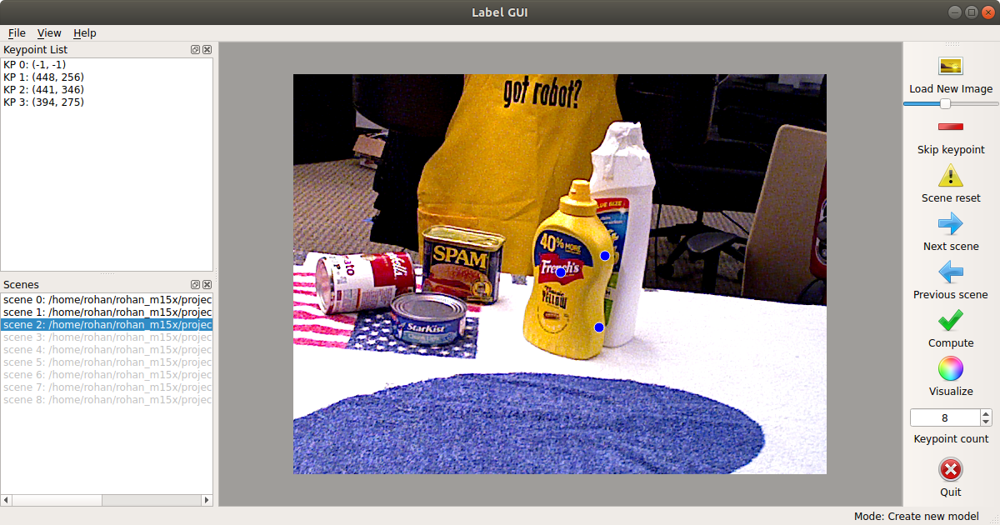

### Update: Docker image (thanks to @avasalya) is [here](https://hub.docker.com/r/avasalya/rpl)
### Update: New PyQt GUI is available.
(with zoom-in/out, go back into scenes, load dataset from GUI, change number of keypoints, keyboard shortcuts, and more features...)  

---
## [Click here for step-by-step tutorial.](https://github.com/rohanpsingh/RapidPoseLabels/blob/master/tutorial/how-to-use-no-model.md)
## [Click here for sample dataset.](https://o365tsukuba-my.sharepoint.com/:u:/g/personal/s2130175_u_tsukuba_ac_jp/EclNP8KF-ghAtyFBTBqEJGYBH33m66jMeWfWSrLIFTRMuA?e=ihx63j)
---


# Automated Data Annotation for 6-DoF Object Pose Estimation


Code for the paper:  
[**Rapid Pose Label Generation through Sparse Representation of Unknown Objects**](https://arxiv.org/pdf/2011.03790.pdf) (ICRA 2021)  
[Rohan P. Singh](https://rohanpsingh.github.io), [Mehdi Benallegue](https://unit.aist.go.jp/jrl-22022/en/members/member-benalleguem.html), [Yusuke Yoshiyasu](https://unit.aist.go.jp/jrl-22022/en/members/member-yoshiyasu.html), [Fumio Kanehiro](https://unit.aist.go.jp/jrl-22022/en/members/member-kanehiro.html)

This is a tool for rapid generation of labeled training dataset primarily for the purpose of training keypoint detector networks for full pose estimation of a rigid, non-articulated 3D object in RGB images.


We provide a GUI to fetch minimal user input. Using the given software, we have been able to generate large, accurately--labeled, training datasets consisting of multiple objects in different scenes (environments with varying background conditions, illuminations, clutter etc.) using just a handheld RGB-D sensor in only a few hours, including the time involved in capturing the raw dataset. And ultimately, used the training dataset for training a bounding-box detector ([YOLOv3](https://github.com/AlexeyAB/darknet)) and a keypoint detector network ([ObjectKeypointTrainer](https://github.com/rohanpsingh/ObjectKeypointTrainer)).

The code in this repository forms Part-1 of the full software:


Links to other parts:
- Part-2: [ObjectKeypointTrainer](https://github.com/rohanpsingh/ObjectKeypointTrainer)
- Part-3: Not-yet-available

## Dependencies

All or several parts of the given Python 3.7.4 code are dependent on the following:
- PyQt5
- OpenCV
- [open3d](http://www.open3d.org/docs/release/getting_started.html)
- [transforms3d](https://matthew-brett.github.io/transforms3d)

We recommend satisfying above dependencies to be able to use all scripts, though it should be possible to bypass some requirements depending to the use case. We recommend working in a [conda](https://docs.conda.io/en/latest/) environment.
### Other dependencies
For pre-processing of the raw dataset (extracting frames if you have a ROS bagfile and for dense 3D reconstruction) we rely on the following applications:
1. [bag-to-png](https://gist.github.com/rohanpsingh/9ac99c46aef8ccb618cdad18cd20e068)
2. [png-to-klg](https://github.com/HTLife/png_to_klg)
3. [ElasticFusion](https://github.com/mp3guy/ElasticFusion)

## Usage
### 1. Preparing the dataset(s)
We assume that using [bag-to-png](https://gist.github.com/rohanpsingh/9ac99c46aef8ccb618cdad18cd20e068), [png-to-klg](https://github.com/HTLife/png_to_klg) and [ElasticFusion](https://github.com/mp3guy/ElasticFusion), the user is able to generate a dataset directory tree which looks like follows:
```
dataset_dir/
├── wrench_tool_data/
│   ├── 00/
│	│	├── 00.ply
│	│	├── associations.txt
│	│	├── camera.poses
│	│	├── rgb/
│	│	└── depth/
│   ├── 01/
│   ├── 02/
│   ├── 03/
│   ├── 04/
│   └── camera.txt
├── object_1_data/...
└── object_2_data/...
```
where ```camera.poses``` and ```00.ply``` are the camera trajectory and the dense scene generated by ElasticFusion respectively. Ideally, the user has collected raw dataset for different scenes/environments in directories ```00, 01, 02,...``` . ```camera.txt``` contains the camera intrinsics as ```fx fy cx cy```.

### 2. How to use
This should bring up the main GUI:
```
$ python main.py
```
<p align="center">

<p>

#### a. If object model is NOT available
In the case where the user has no model of any kind for their object, the first step is to generate a sparse model using the GUI and then build a rough dense model using the ```join.py``` script. 

To create the sparse model, first choose about 6-10 points on the object. Since you need to click on these points in RGB images later, make sure the points are uniquely identifiable. Also make sure the points are well distributed around the object, so a few points are visible if you look at the object from any view. Remember the order and location of the chosen points and launch the GUI, setting the ```--keypoints``` argument equal to the number of chosen keypoints.

1. Go to 'File' and 'Load Dataset'.
2. Click on 'Next scene' to load the first scene.
3. Click on 'Load New Image' and manually label all keypoints decided on the object which are visible.
4. Click on 'Skip keypoint' if keypoint is not visible (**Keypoint labeling is order sensitive**).
5. To shuffle, click on 'Load New Image' again or press the spacebar.
6. Click on 'Next scene' when you have clicked on as many points as you can see.
7. Repeat Steps 2-5 for each scene.
8. Click on 'Compute'.

If manual label was done maintaining the constraints described in the paper, the optimization step should succeed and produce a ```sparse_model.txt``` and ```saved_meta_data.npz``` in the output directory. The ```saved_meta_data.npz``` archive holds data of relative scene transformations and the manually clicked points with their IDs (important for generating the actual labels using ```generate.py``` and evaluation with respect to ground-truth, if available).

The user can now generate a dense model for their object like so:
```
$ python join.py --dataset <path-to-dataset-dir> --sparse <path-to-sparse-model.txt> --meta <path-to-saved-meta-data>
```
The script will end while throwing the Open3D Interactive Visualization window. Perform [manual cropping](http://www.open3d.org/docs/release/tutorial/visualization/interactive_visualization.html#crop-geometry) if required and save as ```dense.ply```.

#### b. If object model is available
If you already have a model file for your object (generated through CAD, scanners etc.), follow these steps to obtain ```sparse_model.txt```:

1. Open the model file in Meshlab.
2. Click on PickPoints (Edit > PickPoints).
3. Pick 6-10 keypoints on the object arbitrarily.
4. "Save" as sparse_model.txt.

Once ```sparse_model.txt``` has been generated for a particular object, it is easy to generate labels for any scene. This requires the user to uniquely localize at least 3 points defined in the sparse model in the scene.

1. Launch the GUI.
2. Go to 'File' and 'Load Dataset'. Then 'Load Model'.
3. Choose a previously generated ```sparse_model.txt``` (A Meshlab *.pp file can also be used in this step).
4. Click on 'Load New Image'.
5. Label at least 3 keypoints (that exist in the sparse model file).
6. Click on 'Skip keypoint' if keypoint is not visible (**Keypoint labeling is order sensitive**).
8. Click on 'Compute'.

"Compute" tries to solve an orthogonal Procrustes problem on the given manual clicks and the input sparse model file. This will generate the  ```saved_meta_data.npz``` again for the scenes for which labeling was done.

### 3. Generate the labels
Once (1) sparse model file, (2) dense model file and (3) scene transformations (in saved_meta_data.npz) are available, run the following command:
```
$ python generate.py --sparse <path-to-sparse-model> --dense <path-to-dense-model> --meta <path-to-saved-meta-data-npz> --dataset <path-to-dataset-dir> --output <path-to-output-directory> --visualize
```
That is it. This should be enough to generate keypoint labels for stacked-hourglass-training as described in [ObjectKeypointTrainer](https://github.com/rohanpsingh/ObjectKeypointTrainer), mask labels for training a pixel-wise segmentation and bounding-box labels for training a generic object detector. Other types of labels are possible too, please create Issue or Pull request :)

### 4. Training
You would probably need to convert the format of the generated labels to suit your requirements.  
If you would like to train our pose estimator, you can directly use [ObjectKeypointTrainer](https://github.com/rohanpsingh/ObjectKeypointTrainer).  
If you would like to train Mask-RCNN for instance segmentation, refer to [this script](https://gist.github.com/rohanpsingh/0aa3d35d8e038a9c2491c68894f0b93b) to convert the binary masks to contour-points in JSON format.

## Contributing
Pull requests are welcome. For major changes, please open an issue first to discuss what you would like to change.

## Citation
If you find this work useful in your own research, please consider citing:
```
@inproceedings{singh2021rapid,
  title={Rapid Pose Label Generation through Sparse Representation of Unknown Objects},
  author={Singh, Rohan P and Benallegue, Mehdi and Yoshiyasu, Yusuke and Kanehiro, Fumio},
  booktitle={2021 IEEE International Conference on Robotics and Automation (ICRA)},
  pages={10287--10293},
  year={2021},
  organization={IEEE}
}
```
