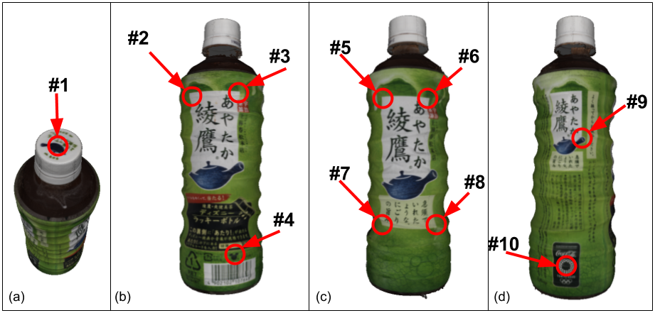
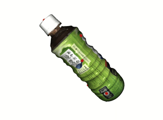
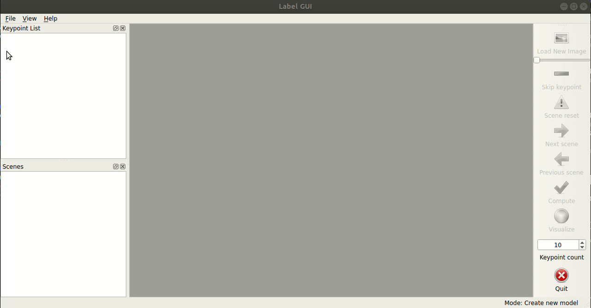
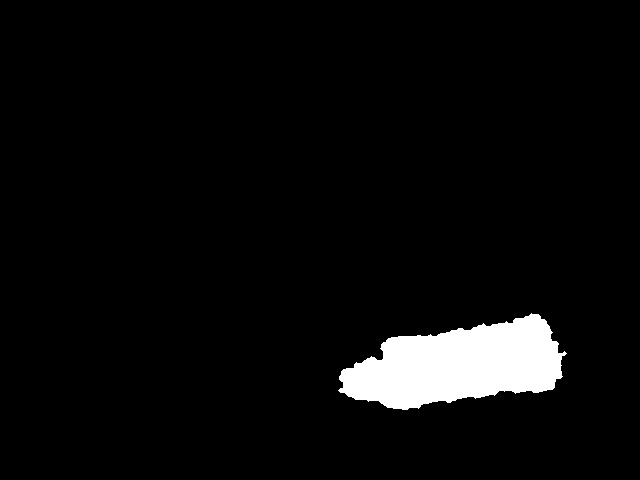

# Tutorial
## How To Use (when you don't have an object model)

## Step 1. Choose the keypoints.
For the tutorial we are going to use [this sample dataset](https://o365tsukuba-my.sharepoint.com/:u:/g/personal/s2130175_u_tsukuba_ac_jp/EclNP8KF-ghAtyFBTBqEJGYBH33m66jMeWfWSrLIFTRMuA?e=ihx63j). Download and move it into `rapidposelabels/data/`.  

It consists of the Oolong Tea object in 5 different RGB-D scenes. The scene meshes and camera trajectory have already been generated using ElasticFusion and available with the dataset.
Choosing the location and number of keypoints on the object is up to the user. But, for the sake of this exercise, let's pick the following 10 points:

<p align="left">
  
  
<p>

## Step 2. Launch the GUI.
Assuming you decided to go with the 10 keypoints above, fire up the GUI with this command:  

```
$ python main.py --output tutorial_no_model --keypoints 10
```

## Step 3. Load Dataset
Once the main window pops up, go to *'Load Dataset'* under the *'File'* menu. This will show all the loaded scenes under the chosen directory in the *'Scenes'* dock window. Next, click on *'Next scene'* and *'Load New Image'* to load a random frame from the first scene.  

<p align="center">
  
<p>

## Step 4. Begin annotation.
Start to label the chosen points sequentially in the GUI. Use the *'Load New Image'* or the slider to display new images from the scene. Mark as many points you can in this scene and click 'Next scene' when you're done. **Note that:**  

- If you don't see a keypoint and want to move to the next one, click *'Skip keypoint'*. This create a [-1, -1] keypoint in the dock window.  

- Clicking on *'Next scene'* will fill up the remaining points with [-1, -1], i.e. remaining points will be skipped.  

- (If a point vanishes in the GUI when you load a new image, this means the depth value at that location could not be obtained. Please click 'Scene reset' and mark all points in this scene again when this happens.)

<p align="center">
  
<p>

Annotate the rest of the scenes and finally click *'Compute'*. All scenes should take only a few minutes.  


#### Watch the **[YouTube video](https://www.youtube.com/watch?v=e6bP9GrrRBU)** for the entire process

<div align="center">
      <a href="http://www.youtube.com/watch?v=e6bP9GrrRBU">
     
      </a>
    </div>

## Step 5. Generate the dense model.
If you followed the steps above, you should have the files `tutorial_no_model/saved_meta_data.npz` and `tutorial_no_model/sparse_model.txt` now.  
You can generate the dense model with the following command:
```
$ python join.py --dataset ../data/oolong/ --sparse tutorial_no_model/sparse_model.txt --meta tutorial_no_model/saved_meta_data.npz
```
This will use the `RegionGrowing` class to build a dense model and open the [Open3D interactive visualization](http://www.open3d.org/docs/0.10.0/tutorial/Advanced/interactive_visualization.html#crop-geometry) window. You can use it crop the excess artifacts:
> After adjusting viewing orientation, press K to lock screen and to switch to the selection mode.
> To select a region, use either mouse drag (rectangle selection) or ctrl + left mouse click (polygon selection).
> Press 'C' to get a selected geometry and to save it.
Make sure to save the cropped point cloud as `tutorial_no_model/dense.ply`.  

Here is what the cropped point cloud should look like:
<p align="center">
  
<p>
  
Not too bad for such small effort! But we see one face has a large hole. This happened because our sample dataset did not have enough points for one of the faces. So you need to ensure all faces are adequately captured in your dataset. Nevertheless, let's proceed to generating the labels.

## Step 6. Generate labels.
Use the following commands:
```
$ python generate.py --dataset ../data/oolong/ --sparse tutorial_no_model/sparse_model.txt --dense tutorial_no_model/dense.ply --meta tutorial_no_model/saved_meta_data.npz  --output tutorial_no_model/labels
```
The labeled dataset will be created under the `labels` directory. You can edit the `Annotations` class to obtain the labels in the format required for your application. Here are some examples of the generated masks:  
<p align="left">
  
  
  
<p> 
  

Use the labeled dataset to supervise your learning task.  
Happy training!

---
FIN.
